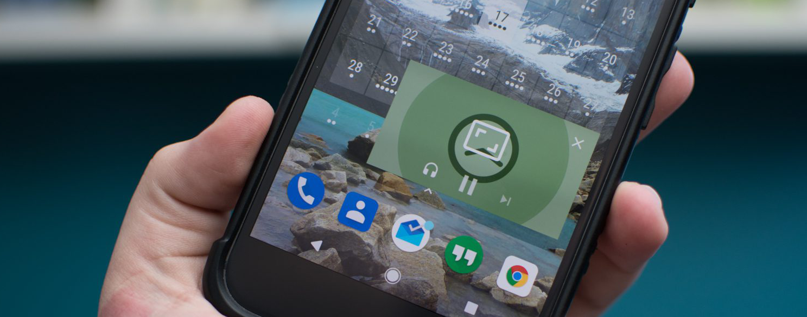

#### Picture in picture
<span style="color:gray">Android 8.0</span>
<br>
<span style="color:gray; font-size:0.5em;">29-09-2017</span>

---

### <span style="color: #00B8D4; text-transform: none">Activity</span> <span style="text-transform: none">to declare in manifest</span>
<br>

```xml
<activity android:name=".MainActivity"
    android:resizeableActivity="true"
    android:supportsPictureInPicture="true"
    android:configChanges="screenSize|smallestScreenSize|
        screenLayout|orientation" />
```

<span style="color:gray; font-size:0.6em;">AndroidManifest.xml</span>

---

### <span style="color: #00B8D4; text-transform: none">Switch</span> <span style="text-transform: none">into picture-in-picture</span>
<br>

##### <span style="text-transform: none; font-size:0.8em;">KEYCODE_WINDOW</span> <span style="color: #00B8D4; font-size:0.8em;">[171](https://developer.android.com/reference/android/view/KeyEvent.html#KEYCODE_WINDOW)</span>

```
adb shell input keyevent 171
```
</br>

##### <span style="text-transform: none; font-size:0.8em;">Programmatically</span>

```kotlin
@TargetApi(Build.VERSION_CODES.O)
private fun minimize() {
    val builder = PictureInPictureParams.Builder()
    builder.setAspectRatio(Rational(dimX, dimY))
    enterPictureInPictureMode(builder.build())
}
```

<span style="color:gray; font-size:0.6em;">MainActivity.kt</span>
</br>
<span style="color:gray; font-size:0.4em;">Aspect ratio limitation: must be between 0.42 and 2.39</span>

---

### <span style="color: #00B8D4; text-transform: none">Handling</span> <span style="text-transform: none">activation</span>
<br>

```kotlin
override fun onPictureInPictureModeChanged(
        isInPictureInPictureMode: Boolean, 
        newConfig: Configuration?) {
    super.onPictureInPictureModeChanged(isInPictureInPictureMode, newConfig)
    val visible = if (isInPictureInPictureMode) View.GONE else View.VISIBLE
    findViewById<View>(R.id.toolbar).visibility = visible
    findViewById<View>(R.id.bottom_navigation).visibility = visible
}
```

<span style="color:gray; font-size:0.6em;">MainActivity.kt</span>

---

### Demo

[Video](https://www.youtube.com/embed/HRJFT3urgGI)

<span style="color:gray; font-size:0.5em;">Source: github.com/googlesamples/android-PictureInPicture</span>
</br>
<span style="color:gray; font-size:0.5em;">Pres Source: github.com/Mercandj/tracker-android</span>
