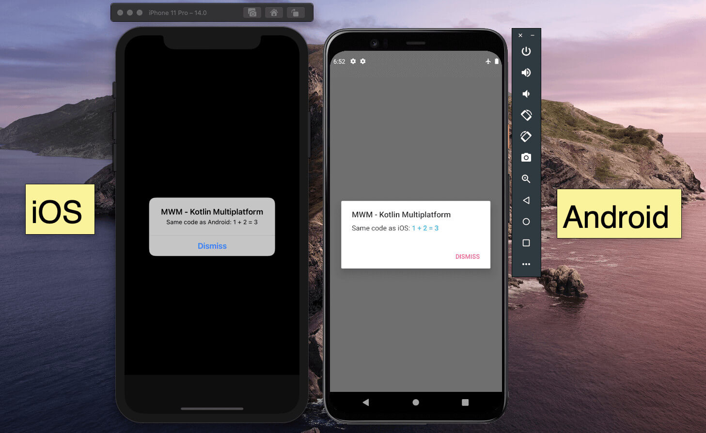

<br/>
<br/>
<br/>
<br/>

<span style="color:gray; font-size:0.8em;">Introduction to </span>
<br/>

#### <span style="text-transform: none">Kotlin </span> <span style="text-transform: none; color: #00B8D4">Multiplatform</span>
<br/>


<span style="color:gray; font-size:0.5em;">2020-09-24 - Kotlin </span> <span style="color: #00B8D4; font-size:0.6em;">1.4.0</span>
<br/>
<span style="color:gray; font-size:0.5em;">Github </span> <span style="color: #00B8D4; font-size:0.5em;">Mercandj/presentation</span>


Note:

- Version of kotlin is important, all result could change in next / previous version
- Find the presentation and source [here](https://github.com/Mercandj/presentation)

---


---



---

### <span style="color: #00B8D4; text-transform: none; font-size:0.8em;">3 points</span><span style="text-transform: none; font-size:0.8em;"> to remember</span>
<br>

@ul[circles](true)
- <span style="color: #00B8D4">expect</span> / <span style="color: #00B8D4">actual</span> kotlin keywords
- <span style="color: #00B8D4">@ThreadLocal</span> for mutable classes
- <span style="color: #00B8D4">FatFramework</span> VS <span style="color: #00B8D4">XCframework</span>
@ulend

---

### <span style="text-transform: none; font-size:0.8em; color: #00B8D4;">expect </span><span style="text-transform: none; font-size:0.8em;"> / </span><span style="text-transform: none; font-size:0.8em; color: #00B8D4;"> actual</span>

```kotlin
// src/commonMain/kotlin/<package>
expect class LogPlatform() {

    fun log(tag: String, message: String)
}
```

---

### <span style="text-transform: none; font-size:0.8em; color: #00B8D4;">expect </span><span style="text-transform: none; font-size:0.8em;"> / </span><span style="text-transform: none; font-size:0.8em; color: #00B8D4;"> actual</span>

```kotlin
// src/commonMain/kotlin/<package>
expect class LogPlatform() {

    fun log(tag: String, message: String)
}
```

```kotlin
// src/androidMain/kotlin/<package>
actual class LogPlatform {

    actual fun log(tag: String, message: String) {
        android.util.Log.d(tag, message)
    }
}
```

---

### <span style="text-transform: none; font-size:0.8em; color: #00B8D4;">expect </span><span style="text-transform: none; font-size:0.8em;"> / </span><span style="text-transform: none; font-size:0.8em; color: #00B8D4;"> actual</span>

```kotlin
// src/commonMain/kotlin/<package>
expect class LogPlatform() {

    fun log(tag: String, message: String)
}
```

```kotlin
// src/iosArm64Main/kotlin/<package>
actual class LogPlatform {

    actual fun log(tag: String, message: String) {
        println("[$tag] $message")
    }
}
```

---

### <span style="color: #00B8D4; text-transform: none; font-size:0.8em;">3 points</span><span style="text-transform: none; font-size:0.8em;"> to remember</span>
<br>

@ul[circles](true)
- <span style="color: #00B8D4">expect</span> / <span style="color: #00B8D4">actual</span> kotlin keywords
- <span style="color: #00B8D4">@ThreadLocal</span> for mutable classes
@ulend

---

### <span style="text-transform: none; font-size:0.8em; color: #00B8D4;">@</span><span style="text-transform: none; font-size:0.8em; color: #00B8D4;">ThreadLocal</span>

---

### <span style="text-transform: none; font-size:0.8em; color: #00B8D4;">@</span><span style="text-transform: none; font-size:0.8em; color: #00B8D4;">ThreadLocal</span>
<br>

@ul[circles](true)
- You <span style="color: #00B8D4">WILL</span> have crash the first time =)
- <span style="color: #00B8D4">Immutability</span>: reason <span style="color: #00B8D4">thread</span>
- <span style="color: #00B8D4">@ThreadLocal</span> for mutable classes
- https://github.com/JetBrains/kotlin-native/blob/master/IMMUTABILITY.md
@ulend


---

### <span style="color: #00B8D4; text-transform: none; font-size:0.8em;">3 points</span><span style="text-transform: none; font-size:0.8em;"> to remember</span>
<br>

@ul[circles](true)
- <span style="color: #00B8D4">expect</span> / <span style="color: #00B8D4">actual</span> kotlin keywords
- <span style="color: #00B8D4">@ThreadLocal</span> for mutable classes
- <span style="color: #00B8D4">FatFramework</span> VS <span style="color: #00B8D4">XCframework</span>
@ulend


---

### <span style="text-transform: none; font-size:0.8em; color: #00B8D4;">FatFramework</span><span style="text-transform: none; font-size:0.8em; color: #000000;"> VS </span><span style="text-transform: none; font-size:0.8em; color: #00B8D4;">XCframework</span>

---

### <span style="text-transform: none; font-size:0.8em; color: #00B8D4;">iOS</span><span style="text-transform: none; font-size:0.8em; color: #000000;"> frameworks</span>

```shell
./gradlew multi_platform:linkReleaseFrameworkIosArm64
./gradlew multi_platform:linkReleaseFrameworkIosX64
```

---

### <span style="text-transform: none; font-size:0.8em; color: #00B8D4;">Fat</span><span style="text-transform: none; font-size:0.8em; color: #00B8D4;">Framework</span>

```kotlin
tasks.register(
    "iosFrameworkRelease",
    org.jetbrains.kotlin.gradle.tasks.FatFrameworkTask::class
) {
    baseName = "multi_platform"
    from(
        kotlin.iosArm64().binaries.getFramework("Release"),
        kotlin.iosX64().binaries.getFramework("Release")
    )
    destinationDir = buildDir.resolve(
        "bin/ios/releaseFramework"
    )
}
```

---

### <span style="text-transform: none; font-size:0.8em; color: #00B8D4;">XCFramework</span>

```bash
xcodebuild -create-xcframework \
   -framework iosArm64/multi_platform.framework \
   -framework iosX64/multi_platform.framework \
   -output ios/multi_platform_youtube.xcframework
```

---

### <span style="color: #00B8D4; text-transform: none; font-size:0.8em;">3 points</span><span style="text-transform: none; font-size:0.8em;"> to remember</span>
<br>

- <span style="color: #00B8D4">expect</span> / <span style="color: #00B8D4">actual</span> kotlin keywords
- <span style="color: #00B8D4">@ThreadLocal</span> for mutable classes
- <span style="color: #00B8D4">FatFramework</span> VS <span style="color: #00B8D4">XCframework</span>

---

### <span style="color: #00B8D4; text-transform: none; font-size:0.8em;">DEMO</span>

---

### <span style="color: #00B8D4; text-transform: none; font-size:0.8em;">DEMO</span>


---

### <span style="color: #00B8D4; text-transform: none; font-size:0.8em;">DEMO</span>

@ul[circles](true)
- 1 - Project setup
- 2 - "Addition" example
- 3 - Frameworks
- 4 - Swift client
- 5 - Android client
- 6 - Log expect / actual
- 7 - Serialization
- 8 - Network
- Bonus - Cross module dependencies
- Bonus - My usecase with delegates
@ulend