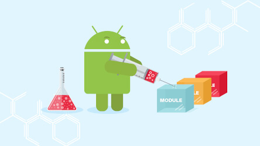

MWM 

#### Wednesday Meet

Android  Team

---

### Sujets du moment (10min)

@ul[circles](true)
- par squads, évoquer les apps en cours
- individuellement, évoquer les MAJ effectuées avec leur objectif
- individuellement, évoquer les sujets "chauds" / "délicats"
@ulend

---

### Présentation (10min)

@ul[circles](true)
- partage d'un point de vue sur un sujet
- nous en discutons ensemble
@ulend

---

### Débat & discussion (10min)

@ul[circles](true)
- expose les faits et le problème
- nous discutons ensemble des différentes solutions
- trachons si clear winner sur la discussion
@ulend

---

### Sujet libre (10min)

@ul[circles](true)
- parler de l'équipe, de la boite, etc.
@ulend

---